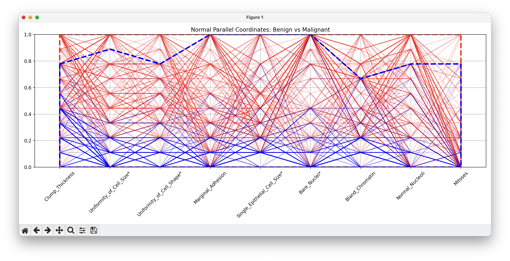
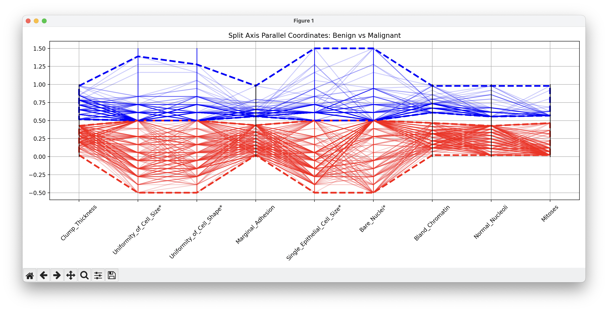

# SplitAxisParallelCoordinates

Split Axis Parallel Coordinates

## Screenshots

Wisconsin Breast Cancer diagnostic data:

Normal parallel coordinates:

Split axis parallel coordinates:

Fisher Iris Examples of Setosa vesus other classes:

Setosa versus Veriscolor in normal parallel coordinats:

Setosa versus Veriscolor in split parallel coordinats:

Setosa versus Virginica in normal parallel coordinats:

Setosa versus Virginica in split parallel coordinats:

