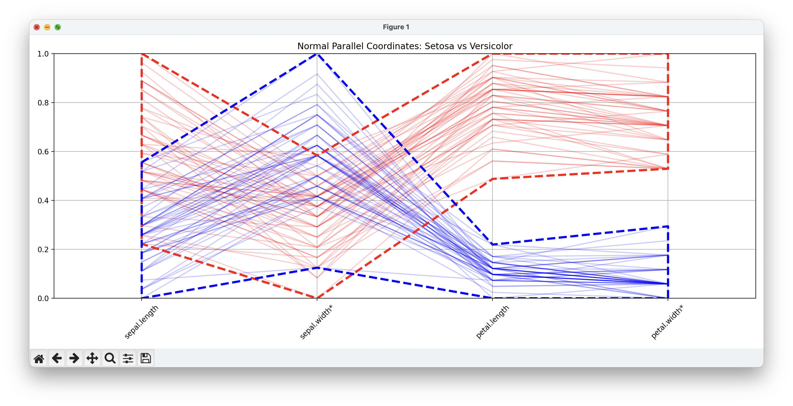
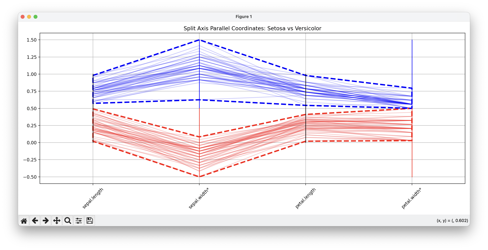
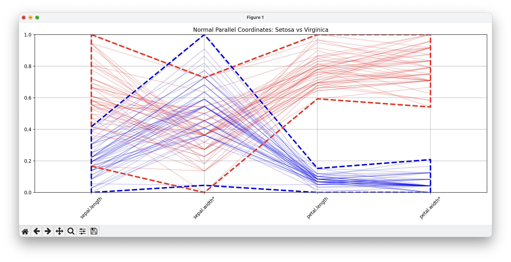
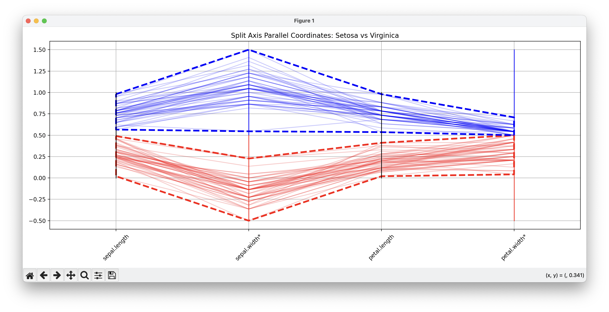

# SplitAxisParallelCoordinates

Split Axis Parallel Coordinates

## Screenshots

Setosa versus Veriscolor in normal parallel coordinats:

Setosa versus Veriscolor in split parallel coordinats:

Setosa versus Virginica in normal parallel coordinats:

Setosa versus Virginica in split parallel coordinats:

